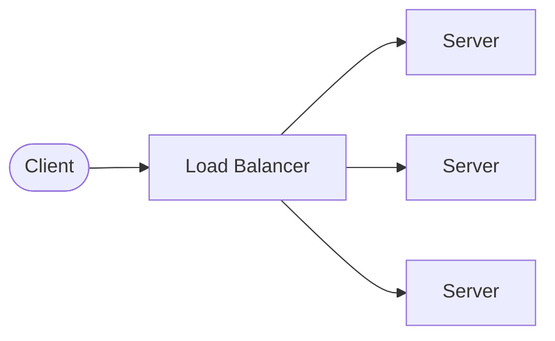
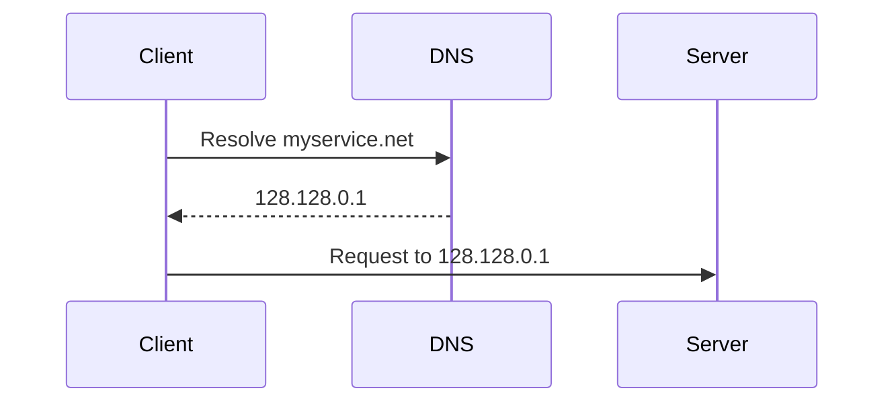
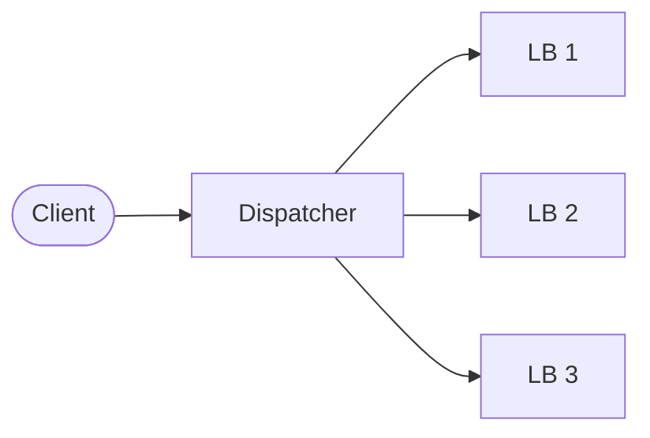
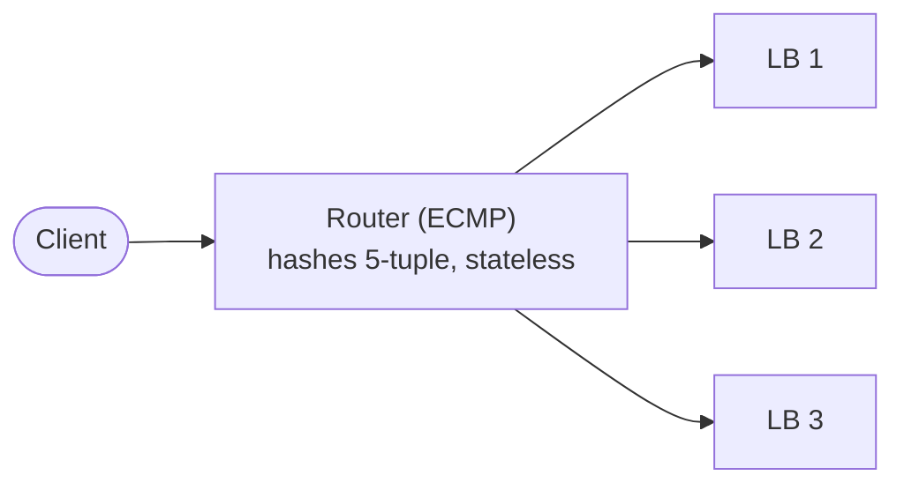
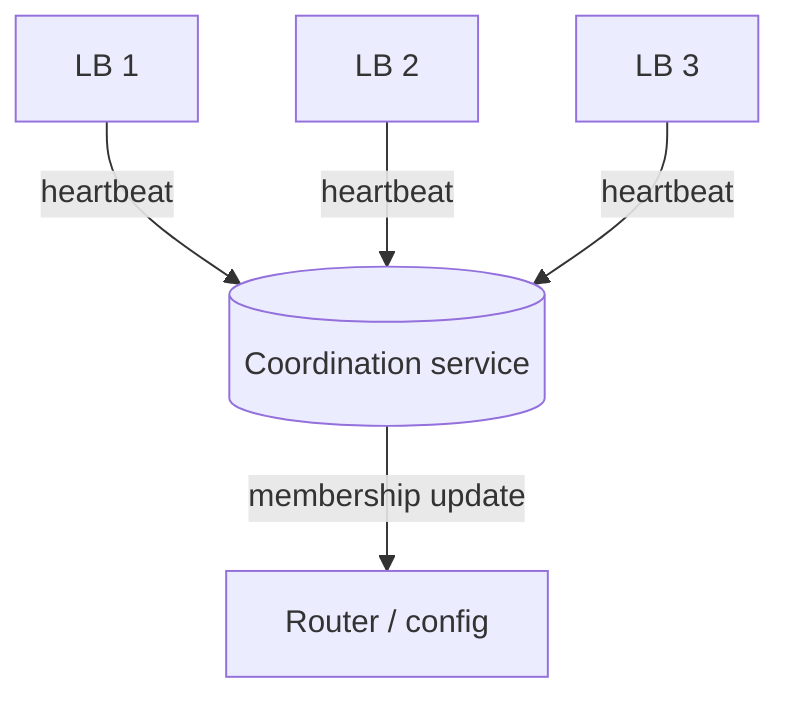
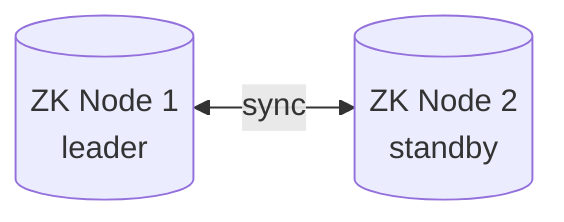
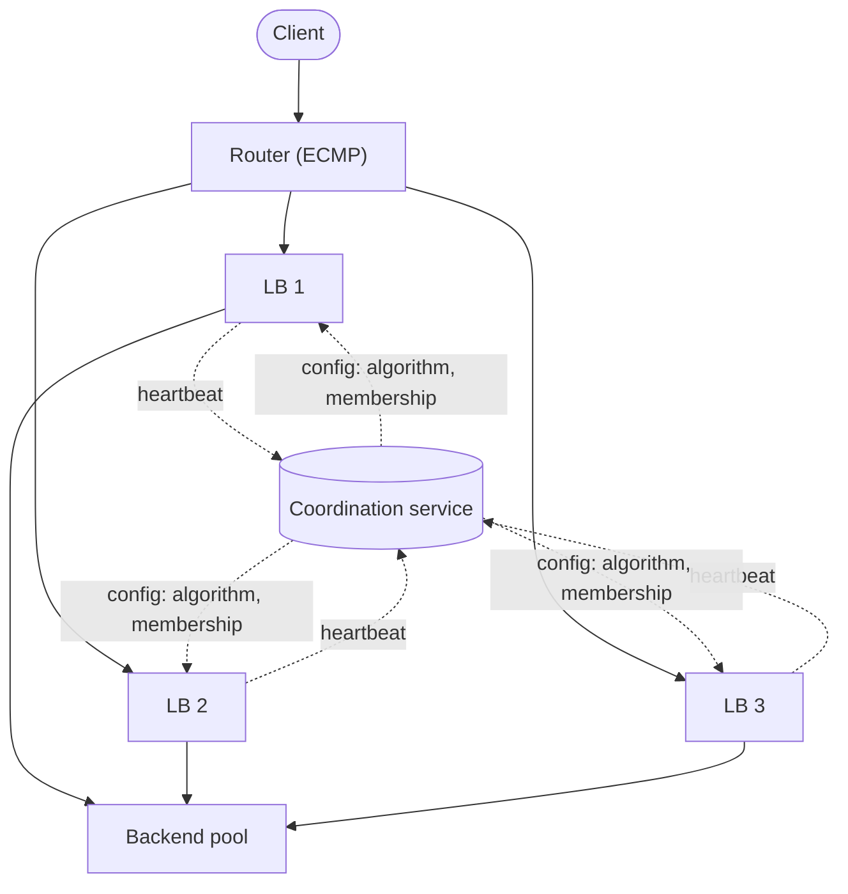

*Part of the "System Design From First Principles" series.*

Most system design explanations hand you a finished architecture diagram and ask you to admire it. That's not how you actually learn to design systems — you learn by hitting a wall, noticing why the wall is there, and figuring out what to build next. This post walks through designing a load balancer the way you'd actually arrive at it: start naive, break it, fix it, break it again.

By the end you'll understand not just *what* a production load balancing layer looks like, but *why* every piece of it exists.

---

## 1. The problem

You have a service getting more traffic than one server can handle. You need to:

- **Balance the load** across multiple servers
- Use **tunable algorithms** (round robin, least connections, weighted, etc. — the right choice depends on your traffic shape)
- **Scale beyond one machine**, including the load balancer itself eventually

The naive picture looks like this:

This works. Until it doesn't.

---

## 2. The load balancer itself has limits

A single load balancer instance has finite CPU and RAM. It can only hold open so many concurrent connections — let's say, hypothetically, 1000. Past that, it queues or drops requests.

So the "solution" is obvious: run more than one load balancer. But this immediately raises a question that trips up a lot of people the first time they think about it seriously:

> **If there are multiple load balancers, how does a client's request even reach one of them?**

To answer that we need to back up one more step and look at what happens *before* a request ever reaches your infrastructure.

### DNS resolution, quickly

Say your website is `myservice.net`. A client doesn't know an IP address — it knows a domain name.

DNS resolves the domain to an IP address, and the client hits that IP directly. That IP address is where your data center — and your fleet of load balancers — lives.

This tells us something important: **DNS gives us one entry point (or a small number of them), but the fan-out to *many* load balancers has to happen after that, inside your infrastructure.**

---

## 3. First (wrong) attempt: a dispatcher in front of the load balancers

A tempting first idea: put one lightweight "traffic cop" server in front of your load balancer fleet, and have it forward each request to one of LB1, LB2, or LB3.

**This doesn't work.** You haven't removed the single point of failure — you've just relocated it. The dispatcher is now the thing that falls over under load or on failure, and everything behind it becomes unreachable.

This is a pattern worth internalizing: **anytime your "fix" for a single point of failure is a single new component, you haven't fixed anything.** You've moved the bottleneck one hop upstream.

---

## 4. The real fix: let the network do the fan-out (ECMP)

Instead of routing decisions living in an application-layer dispatcher, we push the decision down to the **router**, using a mechanism called **ECMP — Equal-Cost Multi-Path routing**.

The core idea:

- The router is told there are multiple equally-valid next hops (LB1, LB2, LB3) for the same destination
- For every incoming packet, it computes a hash over the **5-tuple**: source IP, destination IP, source port, destination port, protocol
- That hash deterministically picks which load balancer the packet goes to

Two properties make this elegant:

1. **No table to maintain.** The router isn't consulting a mapping table that someone has to keep in sync — it's a pure function of the packet headers, computed fresh every time.
2. **Same flow → same load balancer, automatically.** Because a single TCP connection always has the same 5-tuple, every packet in that connection hits the same hash, and therefore the same LB — which is exactly what you want for connection consistency.

This is the piece that's easy to miss when you're designing this for the first time: **you don't need to build a custom routing/mapping layer. This already exists at the networking layer, and it's the standard answer.**

### The tradeoffs, honestly

ECMP isn't magic, and it's worth knowing its rough edges:

- It gives you **load *sharing*, not perfect load *balancing***. Since it hashes per-flow rather than per-request-cost, some load balancers can end up hotter than others depending on the mix of long vs. short-lived connections.
- **Failures cause reshuffling.** If LB3 goes down and is removed from the group, the hash space is recalculated — which can momentarily shift traffic for flows that were happily being served by LB1 or LB2, even though those were never unhealthy. This is a known, accepted cost of the approach, not a bug in your design.
- ECMP itself doesn't health-check anything — it just picks a path from whatever paths it's told are valid. Something else needs to tell it when a path should be removed. That's the next problem.

---

## 5. Detecting failure: health checks

Each load balancer needs a way to know whether the backend servers in its pool are alive, and something needs to know whether each *load balancer* itself is alive.

The standard pattern is a **heartbeat**: every node periodically pings a coordination point (or is pinged) within a fixed time window. Miss enough heartbeats, and you're presumed dead.

A subtlety worth calling out explicitly: **it's cleaner for each load balancer to run its own active health checks against its backend pool**, rather than routing every health signal through a central service. That keeps the coordination layer from becoming a bottleneck under high-frequency health traffic — its job should be limited to lower-frequency concerns: cluster membership, leader election, and configuration.

---

## 6. Who coordinates the coordinators?

If you're using a coordination service (ZooKeeper, etcd, or similar) for leader election and membership, don't forget to ask the same question about it that you asked about the load balancer: **what happens if it goes down?**

The answer is the same shape as before — run more than one, with leader election among *themselves*, so a standby can take over if the leader dies.

This is a good general instinct to build: **every component you add to remove a single point of failure needs to be checked for the same failure mode, recursively, until you hit something you're comfortable treating as durable infrastructure (e.g., a cloud provider's managed quorum service).**

---

## 7. Putting it together

Here's the full picture:

**What each piece is responsible for:**

| Component | Responsibility |
|---|---|
| Router (ECMP) | Stateless fan-out of connections across LB instances |
| Load balancer instances | Distribute requests to backend pool using a tunable algorithm; run their own health checks |
| Backend pool | The actual application servers doing the work |
| Coordination service | Leader election, cluster membership, algorithm/config distribution — *not* per-request routing |

Notice what's **not** in this diagram: there's no single custom "dispatcher," no hand-rolled IP mapping table that needs to be kept in sync across nodes, and no component whose failure takes down the whole path.

---

## 8. Design decisions you still have to make

This architecture is a skeleton, not a finished system. A few open questions worth thinking through (and good candidates for follow-up posts):

- **L4 vs. L7 load balancing** — do your LB instances just forward TCP connections, or do they terminate TLS and route on HTTP path/headers? This changes almost everything downstream, including where you can do content-based routing.
- **Which algorithm, and when** — round robin is simple but ignores server load; least-connections adapts but costs more to compute; consistent hashing matters if you need session affinity.
- **What "unhealthy" means** — a server can be up but slow. Health checks based purely on liveness miss degraded performance.
- **Split-brain during partitions** — if a load balancer is alive but unreachable from the coordination service, you'll deregister a healthy node. Worth deciding upfront whether you'd rather fail open or fail closed here.

---

## Additional resources

- [Equal-Cost Multi-Path (ECMP) — Noction](https://www.noction.com/blog/equal-cost-multipath-ecmp)
- [ECMP Load Balancing — NetActuate Docs](https://www.netactuate.com/docs/guides/ecmp-load-balancing)
- [RFC 2992 — Analysis of an Equal-Cost Multi-Path Algorithm](https://www.rfc-editor.org/rfc/rfc2992)
- [Google's Maglev: A Fast and Reliable Software Network Load Balancer](https://research.google/pubs/maglev-a-fast-and-reliable-software-network-load-balancer/)
- [Apache ZooKeeper documentation](https://zookeeper.apache.org/doc/current/)

---

## Future improvements / open items

This is a living post — things I plan to expand on as this becomes a full course module:

- [ ] Deep dive on L4 vs L7 load balancers with concrete config examples (HAProxy, Envoy, NGINX)
- [ ] Walkthrough of consistent hashing and why it matters for stateful backends
- [ ] Global (multi–data center) load balancing with GeoDNS and anycast — separate from the intra-cluster ECMP problem covered here
- [ ] What happens during a rolling deploy — draining connections gracefully without dropping in-flight requests
- [ ] Observability: what metrics actually tell you your load balancing algorithm is working (p99 latency skew across backends, not just request count)
- [ ] A minimal working implementation (Go or Rust) students can run locally to see ECMP-style hashing behavior in code, even without real router hardware

---

*If you found this useful, this is part of a broader system design series I'm building out — follow along on [GitHub] for the rest.*
