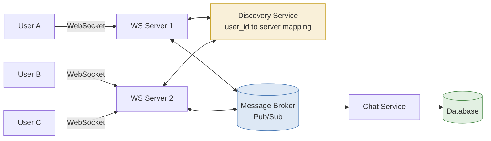
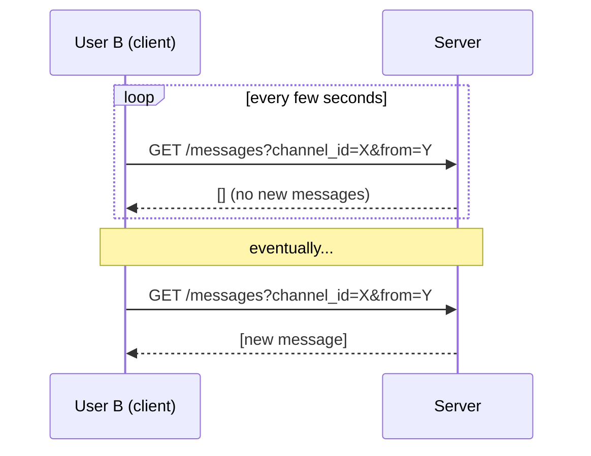
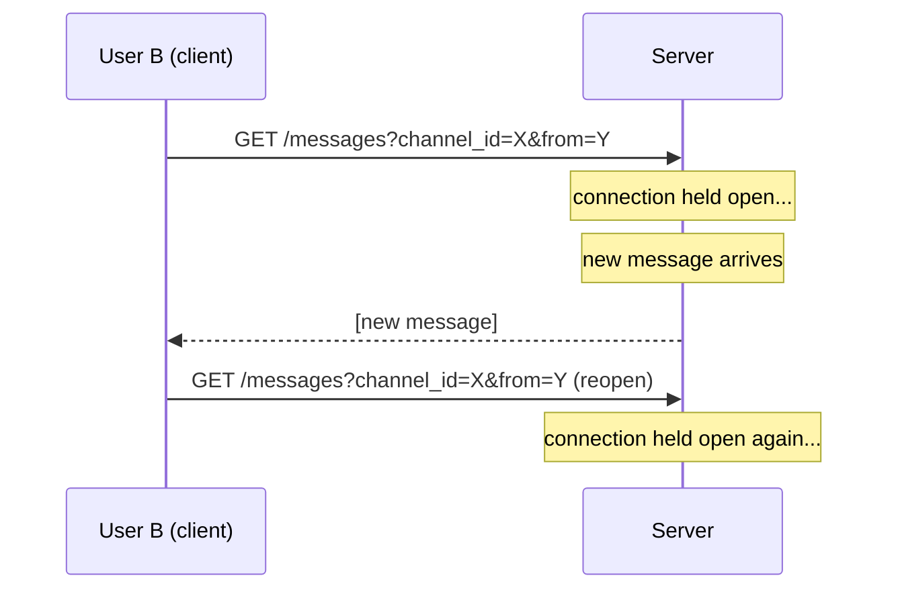
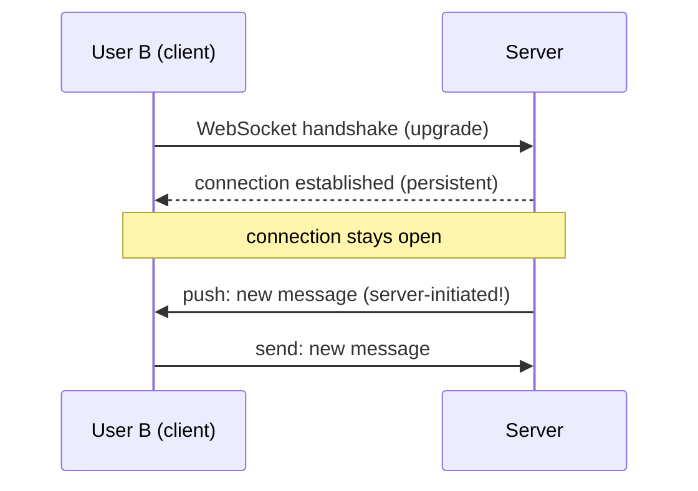
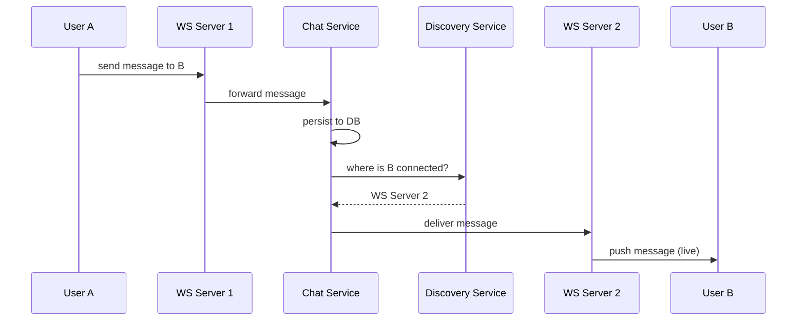
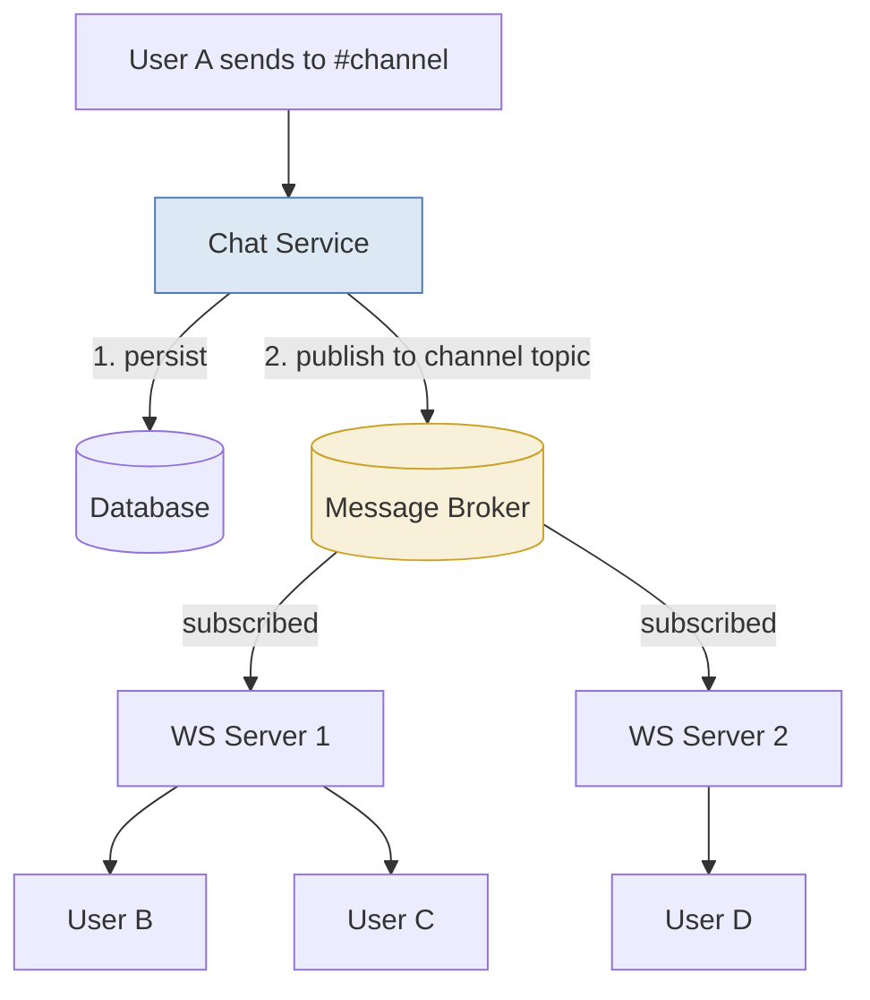
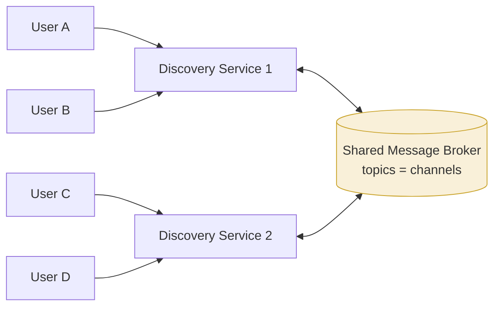

This is a write-up of a system design exercise I worked through for real-time
communication between users, modeled loosely on Slack. It covers the
requirements, the evolution from polling to WebSockets, how to scale
WebSocket connections across multiple servers, and the database schema.

To keep the core design easy to reason about, I've deliberately scoped out
**multi-device support** and **strict message ordering guarantees** — these
are called out as improvements at the end rather than folded into the main
design.

## Requirements

- Multiple users, multiple channels
- Users can DM each other or message in a channel
- Real-time chat — messages should be delivered live, not on refresh
- Historical messages can be scrolled through (pagination)

## Architecture at a Glance

Before diving into the individual pieces, here's the end state we're
building toward: clients hold a persistent WebSocket connection to one of
several WS servers, a discovery layer tracks which server each user is on,
and a Chat Service is the single source of truth for persistence.



- **WS Servers** hold the actual live connections and know nothing about
  routing — they just push to whichever local sockets they're told to.
- **Discovery Service** is the "phone book": given a `user_id`, it tells you
  which WS server (if any) that user is currently connected to.
- **Message Broker** is the pub/sub layer that lets a message published on
  one WS server's side reach a subscriber connected to a *different* WS
  server.
- **Chat Service + DB** is the durability layer — every message is persisted
  here regardless of whether anyone was online to receive it live.

## Data Model

Four core entities:

```
User
  id
  name

Message
  id
  from
  channel_id

Channel
  id
  name
  type: direct / group

ChannelUserMapping
  id
  channel_id
  user_id
```

A few useful queries this schema supports directly:

```sql
-- messages in a channel
SELECT * FROM messages WHERE channel_id = ?

-- users in a channel
SELECT DISTINCT(user_id) FROM channel_user_mapping WHERE channel_id = ?
```

Member joins/leaves are handled as separate operations against
`ChannelUserMapping`, rather than being baked into the channel or message
tables.

## Getting to Real-Time: Three Approaches

### 1. Short Polling

The simplest approach: the client repeatedly calls an endpoint like
`GET /messages?channel_id=?&from=?`, and the server returns new messages if
any exist, or an empty response otherwise.

**Problem:** the client is guessing when to ask. Poll too infrequently and
messages feel delayed; poll too frequently and you're hammering the server
with mostly-empty responses. It's simple but not truly real-time.



### 2. Long Polling

The client keeps the connection open, and the server only responds once a
new message actually shows up (or a timeout elapses, after which the client
reopens the connection).

**Problem:** this is still fundamentally client-initiated. The server can
only *respond* — it can't push new data on a connection unless the client
asked first. That still doesn't give you real bidirectional, low-latency
communication, and the connection *churn* (constantly closing and reopening)
is wasteful.



### 3. WebSockets

WebSockets open a persistent, bidirectional connection between the client
and server. Once established, either side can send data at any time. This is
the right building block for real-time chat — it's the actual mechanism
underneath both Slack and most modern chat apps. (Server-Sent Events were
also considered, but ruled out since they're server-to-client only — the
client still needs a separate channel to send messages.)



## Scaling WebSocket Connections

A single server can only hold so many concurrent open socket connections. If
you have many users, you need multiple servers holding connections, which
introduces a new problem: **if user A is connected to server 1 and sends a
message to user B, who is connected to server 2 — how does server 1 know
where to deliver it?**

### Discovery Service

The fix is a **discovery service** that tracks which server each user's
active WebSocket connection lives on:

- When a client first loads the app, it registers with the discovery
  service, recording which WS server it has an open connection to.
- When user A sends a message, it's routed to a **Chat Service**, which
  persists it to the DB and also asks the discovery service where user B is
  connected.
- If B has an active connection, the message is routed to the correct WS
  server and pushed down B's socket in real time.
- If B isn't connected anywhere, the message is just persisted — B will see
  it next time they load the channel or reconnect.



### Channel / Group Fan-out

For channels (as opposed to 1:1 DMs), the same idea extends via **pub/sub**:
each WS server subscribes to the channels its connected users are members
of. When a message is published to a channel, it's fanned out to every WS
server that has at least one relevant subscriber, and each of those servers
pushes it to its own connected sockets.

This is **fan-out-on-write**: the fan-out work happens at message-send time,
not at read time. It's the standard approach for chat systems at Slack's
scale (as opposed to fan-out-on-read, which is more common for large,
algorithmic feeds).



Note the fan-out is **per WS server that has relevant subscribers**, not per
individual user — if 50 channel members happen to be connected to the same
WS server, that's a single publish to that server, which then pushes to its
50 local sockets.

### Avoiding Duplicate Persistence

One subtlety: a message needs to be **persisted** (Chat Service → DB) and
also **delivered live** (via the WS/pub-sub path) — these are two different
concerns and should be handled by two different components, not conflated:

- **Chat Service** is the single source of truth for persistence — it writes
  every message to the DB exactly once.
- The **WS/pub-sub queue** is purely for real-time fan-out to connected
  clients and should not also be treated as a persistence layer. Keeping
  these responsibilities separate avoids double-writes and keeps recovery
  logic simple — if delivery fails, the message is still safely in the DB
  and will show up on next fetch.

## Handling Scale: Sharded Discovery Services

If the number of users is large enough that a single discovery service (or
a single set of WS servers) can't hold all the connection state, you shard
it — e.g., partitioning users across `DiscoveryService1`, `DiscoveryService2`,
etc. Each shard registers itself as a subscriber to the relevant channels /
topics in a shared message broker (SQS/Redis/Kafka-like), so that a message
originating on one shard can still be routed to a user connected via a
different shard.



Each discovery service shard subscribes to the broker on behalf of its own
users' channels, so a message published by a user on `DiscoveryService1` can
still reach a subscriber whose connection lives on `DiscoveryService2`.

## Putting It Together (End-to-End Flow)

1. Client loads the app → registers its WebSocket connection with the
   discovery service.
2. User A sends "Hi" to a channel → goes to the discovery service /
   message-fan-out layer.
3. It checks which channel members have active connections and pushes the
   message to the WS servers those connections live on.
4. In parallel, the message is sent to a queue → picked up by a worker →
   persisted to the DB.
5. Any client without an active connection simply reads the message from
   the DB the next time they open the channel.

## Afterthoughts / Future Improvements

These were intentionally left out of the core design to keep it focused, but
are worth calling out as natural next steps:

- **Multi-device support.** Users are often connected from more than one
  device at once (phone + laptop). The discovery mapping would need to go
  from `user_id → single connection` to `user_id → set of connections`, and
  delivery/read-state would need to account for multiple active sessions per
  user.

- **Strict message ordering guarantees.** With multiple WS servers and a
  pub/sub fan-out layer in between, messages sent close together from
  different servers aren't guaranteed to arrive or be persisted in send
  order. A more complete design would assign each channel's messages a
  monotonically increasing sequence number at write time (e.g., by
  serializing writes per channel, or using a partitioned log like Kafka
  keyed by `channel_id`), and have clients render/order by that sequence
  number rather than by arrival time.

- **Offline push notifications** for users with no active connection at all.

- **Pagination strategy** for scrolling through history — cursor-based
  pagination on `(channel_id, created_at)` rather than naive `SELECT *`.

- **Presence and typing indicators**, which piggyback on the same connection
  infrastructure but weren't part of the core requirements here.