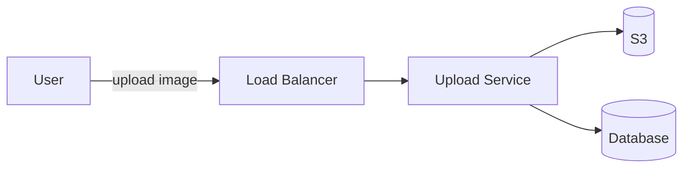
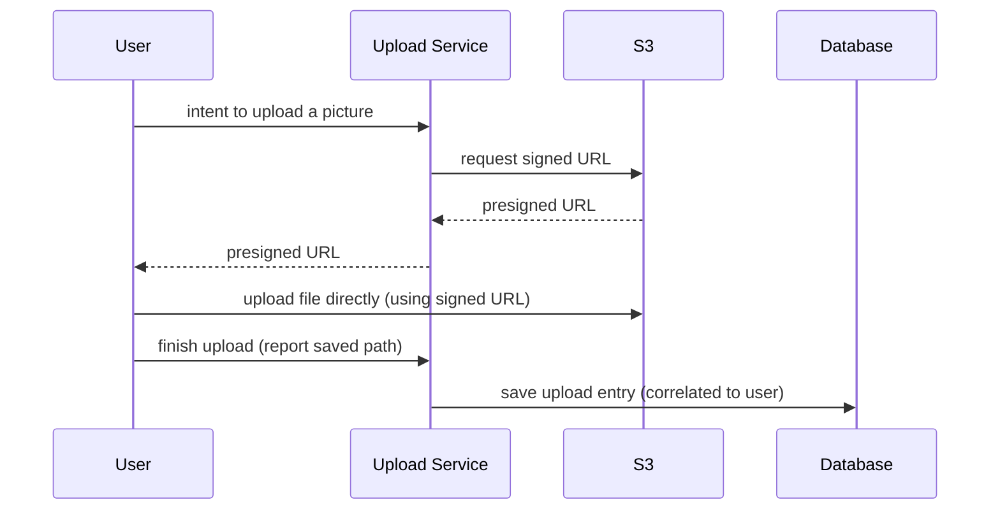

*Note: this post uses Mermaid diagrams for the architecture. If they render as raw code blocks instead of flowcharts, Mermaid isn't enabled on this Jekyll install yet — see the checklist at the bottom.*

This is a working-notes writeup of a system design exercise I did for an image upload service, done as prep during my current job search. I'm capturing it here mostly because the flaw in my first design — and the reasoning that got me to the fix — is a good illustration of a pattern that shows up constantly in real systems: don't put your own servers in the data path when you don't have to.

## The requirements

Rough numbers I set for myself, back-of-envelope style:

- **5 million photo uploads/day**
- Each photo maxes out around **100 MB**
- That works out to roughly **500 TB/day** of upload volume
- Key concerns to design around: storage, data flow, separation of concerns, privacy, extensibility, optimization

## Data model

**Photo**
- `id`
- `userId`
- `path`

**User**
- `id`
- `name`

5 million uploads/day means 5 million new database rows/day just for photo metadata. That's doable on a single well-indexed table for a while, but it's the first place I flagged for sharding if it ever chokes — user ID being the obvious shard key.

## Attempt 1: naive proxy-through-server

The first-pass design was straightforward:

Flow: the user clicks upload, the image streams to the upload service in packets, the service validates size, uploads the file to S3, and — once that succeeds — writes the path/key back to the database. S3 does the heavy lifting of actually storing and serving the files (directly or via CDN, depending on latency requirements).

**Where this falls apart:** the entire image has to pass *through* the API service before it reaches S3. That means the service is holding the full file in memory (or streaming it, but still occupying a request thread/connection) for the whole upload duration.

Running the numbers: if a single machine can reasonably hold ~500 GB of in-flight data, handling 500 TB/day at any reasonable concurrency means needing on the order of **1,000 machines running at full capacity** — and that's optimistic. If you only want to run machines at 60% max capacity (which you should, for headroom), that number climbs further. This is expensive infrastructure, and the cost inevitably gets passed to end users as a premium.

The core issue: **why route image bytes through our system at all, when S3 can accept the upload directly?**

## Attempt 2: presigned URLs

Instead of proxying the upload, the client uploads directly to S3, and our service's job shrinks to just brokering permission and recording metadata.

Flow: the user signals intent to upload. Our server asks S3 for a presigned URL and hands it to the client. The client uploads the actual file **directly to S3** using that URL — our servers never touch the bytes. Once the upload finishes, the client reports back to our service, which writes the metadata row (photo path, correlated to `userId`) into the database.

### Correcting my own notes here

When I first wrote this up, I described the signing mechanism as public/private key decoding. That's wrong, and worth fixing explicitly since it's a detail that matters if you're asked about it in an interview: **presigned URLs use HMAC-SHA256, not asymmetric crypto.** AWS signs the request parameters (bucket, key, expiry, policy conditions) using your AWS secret access key. When S3 receives the request, it recomputes the signature the same way and checks for a match — there's no public/private key pair involved.

### Why this is better

With this approach, the size of our infrastructure drops considerably, because we're no longer in the data path — we only store metadata (userId, key/path), which is not memory-intensive at all.

The load that *does* hit our servers is just presigned-URL requests, which are cheap. If a single machine can comfortably handle 1,000 concurrent requests, and peak traffic on our system is, say, 10,000 concurrent users requesting uploads, 10 instances should be more than sufficient.

### Scoping the presigned URL

One open question I had while working through this: **can the presigned URL be scoped down further** — restricted to a specific `userId`, with a size limit and an expiry, so that anything outside those bounds gets rejected?

The answer, worked out after the fact: yes, and the right tool for it is a **presigned POST with a policy document**, not a bare presigned PUT. A presigned PUT only really constrains the URL itself and its expiry. A presigned POST lets you attach a policy that enforces:

- **Exact key/prefix** — e.g. `{userId}/{uuid}.jpg`, so a user can't overwrite or guess another user's object key
- **`content-length-range`** — a hard file size cap enforced by S3 itself, not just trusted client-side
- **`content-type` restriction** — reject non-image uploads at the S3 level
- **Expiry** — already part of the base presigned URL mechanism

This closes the gap between "we generated a URL" and "we actually constrained what can be done with it."

## What's still unresolved

A few things this design doesn't fully account for yet:

- **Client callback reliability.** The flow assumes the client always calls back to the API after a successful S3 upload, to trigger the database write. That callback can fail to happen — crashed browser tab, dropped connection, user closing the window mid-flow. That leaves an object sitting in S3 with no corresponding database row, and no clean way to reconcile it. The more robust version of this design uses **S3 event notifications → a queue → a worker that writes the DB row**, treating S3 itself as the source of truth rather than trusting the client to report back. The direct client callback can still exist for fast UI feedback, but it shouldn't be the only path that produces a database record.
- **No status field on the photo record.** Once writes can come from an async event source, you need a `status` (pending / uploaded / failed) to represent in-flight state honestly.
- **No processing pipeline.** Thumbnailing, resizing, EXIF stripping — none of that is in this design yet. It would hang off the same S3 event trigger mentioned above.
- **Idempotency.** No handling yet for a retried or double-submitted upload from the same client.
- **Rate limiting.** Nothing currently stops a user from minting a large number of presigned URLs in a short window.

## Closing note

This was a useful exercise precisely because the first draft looked reasonable until I actually did the machine-count math — the naive version doesn't fail on correctness, it fails on cost, and only becomes obvious once you push on the numbers. That's usually where the real design lives.
