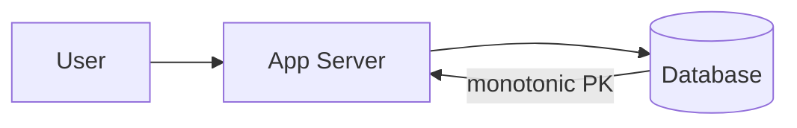
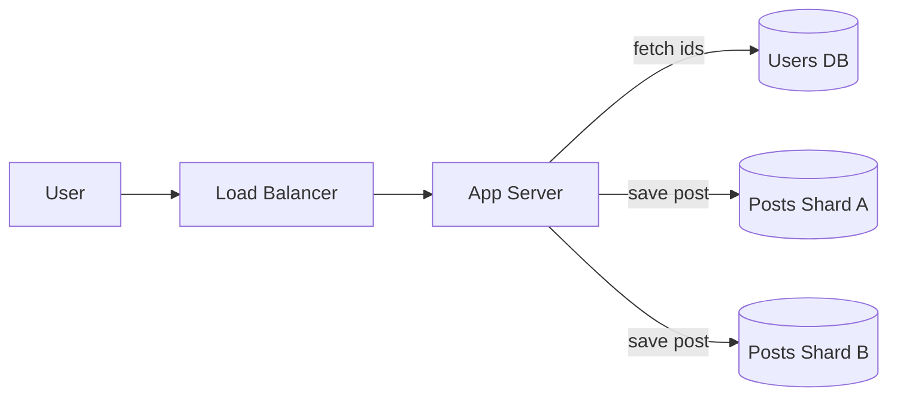
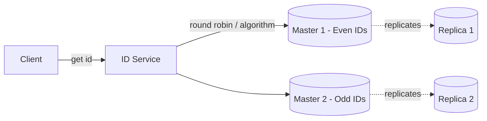
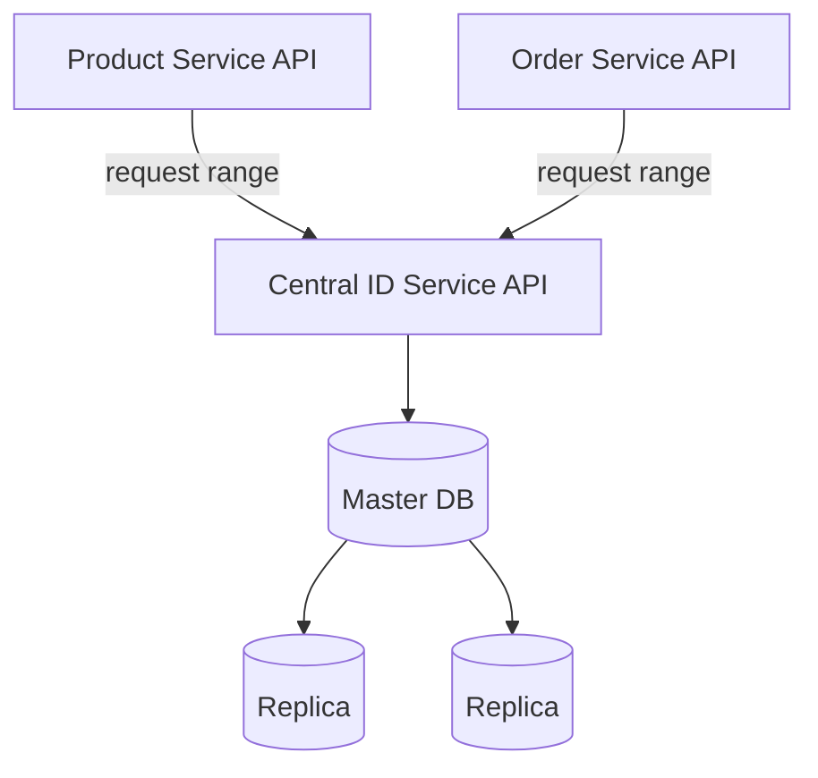
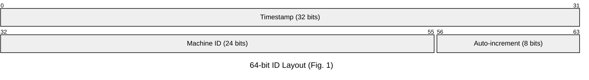
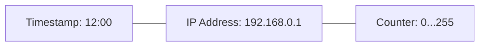

*I'm currently prepping for a system design course, and this post is a write-up of a design exercise I worked through by hand in my notebook — distributed unique ID generation. I'm sharing the raw progression (including the dead ends) because I think seeing *why* each iteration falls short is more useful than jumping straight to the "correct" answer. If you're studying system design too, hopefully this saves you some of the back-and-forth I went through.*

---

## The Problem

We need a way to generate unique IDs for records (say, posts in a social app) across multiple services and multiple database shards, without:

- a single point of failure,
- a throughput bottleneck,
- collisions — even when data physically moves between shards later.

That last constraint turned out to be the one that quietly invalidates a lot of "obvious" solutions, so let's build up to it properly.

### Constraints, stated explicitly

Before picking a design, it's worth pinning down what we actually need, because different designs optimize for different subsets of these:

1. **Uniqueness** — no two entities ever get the same ID, globally.
2. **Availability** — no single node's failure should stop ID generation.
3. **Throughput** — generation shouldn't bottleneck on one database or one service.
4. **Ordering (maybe)** — do we need strict global order, per-shard order, or just "roughly sortable"? This decision alone eliminates several designs immediately.
5. **Shard-migration safety** — if a row moves from shard A to shard B, its ID must still be valid and must not collide with anything already on shard B.

Constraint 5 is the one most write-ups skip, and it's the one that actually shaped my final design.

---

## Attempt 1: Single Database, Auto-Increment

The simplest possible thing: one database owns a monotonically increasing primary key, and every service asks it for the next ID.

**What this gives you:** true strict ordering, trivial to reason about.

**Why it doesn't scale:** it's a single point of failure and a single point of contention. Every ID generation in the entire system serializes through one database. This is fine for a toy app; it's not fine once you're sharding.

---

## Attempt 2: Sharding by User, Relying on Auto-Increment Per Shard

Say we shard the `posts` table by `user_id`. Each shard has its own auto-increment sequence, so IDs increase per-user without needing a global coordinator.

**Tables:**
- `users`: `id`, `name`
- `posts`: `id`, `user_id`, `text`, `body`

**What this gives you:** across shards we can rely on auto-increment, and we know the sequence of posts *per user*, because a single user only makes one post at a time — so there's no ordering ambiguity to worry about for a given user.

**The gap:** there's still a single point of failure *per shard*. If a shard's database goes down, we don't get IDs refreshed, and we can't save posts for any user on that shard. Sharding distributed the load, but it didn't remove the SPOF — it just multiplied it.

---

## Attempt 3: Master-Replica Split by Odd/Even IDs

Next idea: introduce redundancy at the ID-generation layer itself. Run two ID-generating databases — one hands out even IDs, one hands out odd IDs — each backed by a replica that can take over if its master fails.

**What this gives you:** if a primary goes down, its replica is ready to take its place. No more single point of failure for ID generation itself.

**The subtlety:** failover isn't free. If the primary dies right after handing out an ID (say, `id1`) but before the replica received it, replaying from the replica risks reusing `id1`. You can close this gap by waiting for write acknowledgement from the replica before returning the ID to the caller — but that trades write latency for consistency. For most systems, this constraint can be relaxed (occasional gaps are fine, duplicates are not), so I ignored the stronger guarantee here.

**The bigger issue:** this still doesn't scale past 2 (or a handful of) generators, and it doesn't solve the *cross-service* case — what happens when Products and Orders both need independently incrementing IDs?

---

## Attempt 4: A Central ID Service with Leased Ranges

This is the pattern used by systems like Flickr's Ticket Server. Instead of generating individual IDs, a central service hands out **ranges** of IDs to each requesting service, which then increments locally within its lease.

**How it works:**

| id | type | last_range | created_at | updated |
|----|------|-----------|------------|---------|
| 1 | product | 500 | 12:01 | 12:01 |
| 2 | order | 1000 | 1:00 | 1:02 |

- Product service registers with the central ID generator and is given range `1–500`.
- The central service *only* tracks the last-issued range, not every ID — this keeps its own storage trivial.
- When the product service's range is exhausted, it requests a new one and gets `501–1000`, and so on.
- Range size is configurable per service.
- If a product service instance dies mid-range, we don't care about the unused IDs in that range — we just move on and request a new range next time. Gaps are an acceptable cost.

**Making the central service itself resilient:**
- Run multiple central ID service instances, coordinated via leader election, so one instance failing doesn't stop range issuance.
- Run replicas of the underlying database for the same reason.
- To avoid the classic "stop the world" problem, each service should proactively request its *next* range before fully exhausting its current one, with some minimum buffer time — not wait until it's empty.

**What this gives you:** no SPOF, no bottleneck (services generate IDs locally within their lease), works cleanly across independent microservices with different ID needs.

**The cost:** you're now maintaining an external service, with all the operational overhead that implies — another team's on-call rotation, another deployment pipeline, another thing that can be misconfigured.

That last point is what pushed me toward the next question: **what if we don't need an external service at all — what if the ID scheme can be generated correctly by the application layer itself, with zero coordination?**

---

## Attempt 5: Structured, Self-Contained IDs (Snowflake-style)

If a 64-bit primary key is our budget, we can embed everything we need directly into the ID itself, generated locally by each machine using its own system clock — no network call required.

*(Bit widths are illustrative — see note on sizing below.)*

**Why this works:** each machine independently generates unique IDs using:
- a **timestamp** segment (coarse ordering),
- a **machine ID** segment (uniqueness across machines — assigned once at startup, not looked up per-request),
- a **local counter** segment (uniqueness within the same timestamp tick, reset each tick).

With this structure, a single machine can support up to `2^(counter bits)` unique IDs generated within the same timestamp tick — e.g. an 8-bit counter allows 256 concurrently-running "slots" at a given instant before you'd need to wait for the next tick.

**What I initially got wrong (and corrected):** an 8-bit counter over *second*-granularity timestamps caps you at 256 IDs/sec/machine, which is far too low for most real systems. The fix is to drop timestamp granularity to **milliseconds** and size the counter to your actual required throughput per machine (Twitter's original Snowflake uses a 41-bit ms timestamp + 10-bit machine ID + 12-bit sequence = 4096 IDs/ms/machine). The lesson: pick bit widths from real throughput numbers, not round ones.

**Other gaps this design still needs to answer (open questions below):**
- How does a machine get its machine ID assigned safely, with no two machines ever claiming the same one?
- What happens if the system clock moves backward (NTP correction)? Naively, this can produce duplicate or out-of-order IDs.

---

## Attempt 6: UUIDs

The simplest option: use UUIDs, which are designed to be globally unique with a vanishingly small collision probability.

**What this gives you:** zero coordination, no shared state, trivially resilient.

**What it costs you:** random UUIDs (v4) as primary/clustered keys cause significant index fragmentation — inserts land in random positions across a B-tree instead of appending, which increases page splits and hurts write performance at scale. If you want the simplicity of UUIDs without this cost, time-ordered variants (UUIDv7, ULID) are the better default — same uniqueness guarantee, much friendlier to indexing.

---

## Attempt 7: The "IP + Timestamp" Variant (Twitter-inspired)

A variation worth noting: combine a timestamp with something like an IP address (or another local identifier) plus a request counter.

Example: for a Twitter-style posting system —

`posts` table: `id` (the structured ID above), `user_id`, `body`.

If we need to **paginate/iterate** through a user's posts, we additionally need a `last_seen_id` cursor and a page-size parameter (e.g. return the next 1000 after the given cursor) — this cursor-based approach is the general pattern used for generating and iterating over IDs at scale, and roughly mirrors what's publicly known about Twitter's own systems.

**Caveat noted in my draft:** hashing an IP into a fixed number of buckets (e.g. 256) can map two different IPs to the same bucket unless the hash function is collision-resistant — worth being careful about if you go this route.

---

## The Core Question: How Much Ordering Do You Actually Need?

Every design above sits somewhere on a spectrum between **strict global order** and **pure uniqueness with no order at all**. It's worth being explicit that **you cannot have both strict global monotonicity and true distribution.**

Here's why that's not just difficult but fundamentally impossible: guaranteeing that IDs reflect true event order across independent nodes requires each node to know about every other node's most recent issuance *before* generating its own. That's a synchronization barrier on every ID generation — at which point you no longer have a distributed system, you have a single serialization point with extra steps. (This is the same fundamental limit Lamport's happens-before problem describes: without a global clock, "simultaneous" events on separate nodes have no true order, only an imposed one.)

So the real design question isn't "how do I get strict monotonicity, distributed" — it's **"how much ordering do I need, and what am I willing to serialize on to get it?"**

| Approach | Ordering guarantee | Cost |
|---|---|---|
| Single DB auto-increment | True strict monotonic | Full serialization, SPOF |
| Sharded by user | Strict order *per user only* | No global order |
| Central ID service (leased ranges) | Strict within a lease; ranges from different leases can interleave in wall-clock time | External service, added latency |
| Consensus-based counter (Raft/etcd) | Strict monotonic, distributed | Quorum round-trip per ID — expensive |
| Snowflake-style | Monotonic *per machine*; only roughly ordered globally, bounded by clock skew | Cheap, zero coordination |
| UUID / ULID | No order (or k-sortable, for ULID) at all | Cheapest, fully decentralized |

Most systems don't actually need global strict order — they need uniqueness plus *good enough* ordering (e.g. "sortable within a few hundred ms"). Deciding this up front eliminates most of the table immediately.

---

## The Constraint That Changes Everything: Shard Migration

Here's the part of the exercise that reshaped my thinking the most.

The obvious way to guarantee no collisions *across* shards is to bake the shard identity directly into the ID — e.g. `shard_id | sequence`. This works fine right up until you need to **move a row from one shard to another** (rebalancing, resharding, etc.). Once that happens, one of two bad things is true:

- the ID still encodes the *old* shard, silently lying about where the data now lives, or
- you rewrite the ID during migration — which breaks every downstream system that persisted the old ID (foreign keys, caches, URLs, analytics events, external references).

**The fix is to decouple uniqueness from location entirely:**

- The ID's job is *only* to be globally unique (and optionally roughly time-ordered). It should never encode where the row currently lives.
- Routing to the correct shard becomes a **separate concern**, handled by:
  - a lookup/directory layer mapping entity → current shard (updatable independently when data moves), or
  - consistent hashing on a stable business key (e.g. `user_id`/`tenant_id`) that doesn't change even if the row's storage location does.

Concretely, this means the "machine ID" segment in a Snowflake-style ID should identify the **generating process** (an app server instance), not the **shard**. A worker's identity has nothing to do with which shard it happens to be writing to at the time, so IDs stay valid no matter how many times the underlying row moves.

This single decision — never let the ID encode physical location — is what actually satisfies the "no collisions when moving data across shards" constraint. Everything else in this post is really in service of getting to this point.

---

## Open Questions I Haven't Fully Resolved

Writing this up surfaced a few things I still need to think through (or would love input on, if you've solved these):

1. **Worker/machine ID assignment.** How do app server instances safely claim a unique machine ID at startup, with zero risk of two instances claiming the same slot? Candidates: ZooKeeper/etcd ephemeral sequential nodes, Kubernetes StatefulSet ordinals, or a hash-based approach with a startup collision check.
2. **Clock skew and backward jumps.** If NTP corrects a machine's clock backward, a Snowflake-style generator could produce a duplicate or out-of-order ID. What's the right stall-vs-reject policy when `now < last_timestamp`?
3. **Exact bit-width sizing.** My bit allocations in Fig. 1 are still approximations — I want to size timestamp/machine-id/counter segments against actual projected throughput rather than round numbers before treating this as final.
4. **Directory layer consistency.** If routing moves to a separate shard-directory lookup, how strongly consistent does *that* layer need to be? It's now arguably the new critical-path service, and I haven't yet designed its failure modes.
5. **Central ID service vs. self-contained IDs — when is each actually the right call?** I lean toward self-contained (Snowflake-style) for high-throughput, low-coordination needs, and toward a central service when you need centralized auditability or tighter control over ranges. Still refining where the line is.

---

## Why I'm Writing This Down

I'm working through a formal system design course soon, and this exercise (distributed ID generation) is a classic that shows up in most of them — Instagram, Twitter/X, and Discord have all published variants of the "structured 64-bit ID" approach. If you're studying the same material, I'd recommend doing what I did here: work through the naive version first, let it fail for a concrete reason, and only then reach for the "correct" pattern. The failure reasons are what actually stick.

If you spot a flaw in any of the above, or have thoughts on the open questions, I'd genuinely like to hear them.
