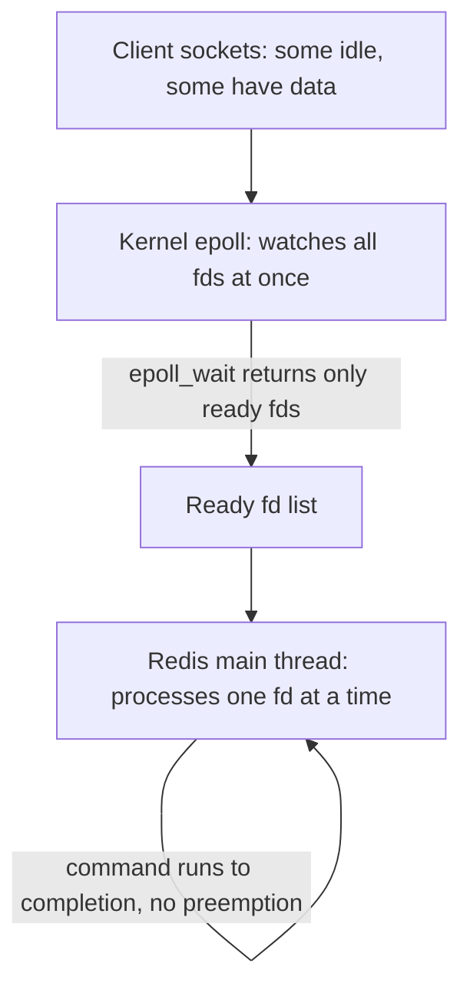
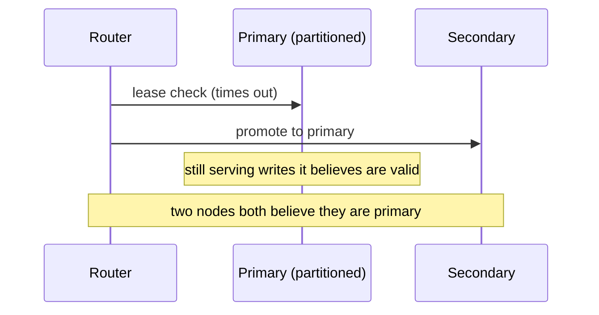

This is a working-notes writeup from a system design practice session — designing a Redis-style distributed cache from scratch, on paper, then pressure-testing it against the kind of questions a skeptical reviewer would ask. I'm posting it mostly unfiltered, including the parts where my first-pass design had real gaps, because working through *why* something was wrong turned out to be more useful than the parts I got right on the first try.

## Requirements

- High throughput, low latency, distributed.
- Core operations: `GET`, `PUT`, `DEL`, TTL, plus a handful of data structures (set, list, dict, graph — graph turned out to be a case I parked for later; more on that below).
- Scale is a default requirement, not an afterthought.

## Single-node design: one thread, one dispatcher

My first instinct was Redis's actual model: a single thread handles every client request. A connection comes in, the OS kernel opens a TCP connection, and one dispatcher processes commands sequentially.

The appeal is real — no locking, no race conditions between threads, and (I initially believed) low latency because the thread "isn't waiting on external I/O." That last part turned out to be a confused way to describe what's actually happening, and unpacking it was the most useful part of this whole exercise.

### Where I had it wrong

My original notes described the dispatcher as something that "checks if it's I/O or a compute operation" and routes accordingly. That framing doesn't hold up. A `GET` on an in-memory hash table isn't I/O at all — it's a pointer lookup in RAM, done in nanoseconds. Nearly everything a cache does is compute, not I/O. The real split isn't I/O-vs-compute, it's **cheap compute vs expensive compute**: a single-key lookup versus something like a set intersection over two million-member sets, which is still "just compute" but can take milliseconds and stalls every other client on the same thread while it runs, because there's no preemption.

Redis's actual mechanism is narrower than what I'd sketched:

The kernel does the waiting — one `epoll_wait` call blocks the whole thread across *every* open socket, and only returns the sockets that actually have data. That's what makes "single thread, thousands of connections" viable. But once a socket is ready and its command starts executing, it runs to completion on the one thread, full stop. There's no built-in check for "is this command about to be expensive" — Redis just runs it.

### What I initially got wrong about handling the expensive case

I considered chunking a big operation — pause partway through a large `SINTERSECT`, let the thread go handle a cheap `GET`, come back and resume. On paper this sounds like it solves the stall. In practice it introduces two problems I didn't have good answers for:

1. **Where does the paused state live?** Something has to remember "I was halfway through comparing set A and set B, here's my partial result" while other commands run in between.
2. **Correctness during the pause.** If a `PUT` or `DEL` modifies one of the two sets while the intersection is paused mid-way, does the final answer reflect the state before or after that mutation? Either answer requires reasoning I hadn't done.

I dropped chunking. The conclusion I landed on — which happens to match how Redis actually behaves in production — is: **an expensive operation blocks everything else for its duration, and that's an accepted cost, not something built in to prevent.** The mitigation isn't clever scheduling, it's operational: log slow commands (Redis's `SLOWLOG` is the real-world version of this), and treat "don't run unbounded operations against a shared cache" as the client's responsibility.

One thing that would have changed this answer: if the cache instance were shared across unrelated teams/services, one tenant's slow command stalling another tenant's fast ones (noisy neighbor) would be a real problem worth solving properly. I scoped that out — each cache instance serves one client, not multiple unrelated ones — which is why "log it and move on" is an acceptable answer here rather than a cop-out.

## Eviction

For eviction I sketched an LRU-style approach: order entries in a queue by recency of use, evict from the head when the cache is full. The honest tradeoff I noted at the time: this requires an extra field per entry (last-accessed timestamp) and a second data structure to maintain alongside the actual cached values, which costs both memory and complexity. I didn't fully resolve which eviction policy to commit to beyond LRU — that's still an open thread.

## TTL expiry

Two mechanisms, and I went back and forth on which was sufficient:

- **Lazy expiry** — check the TTL on access, evict if expired. Cheap, but doesn't reclaim memory for keys nobody ever accesses again.
- **Active expiry** — periodically sweep and evict expired entries. A naive full-keyspace scan on every pass tanks throughput, since it's exactly the kind of long-running operation the single-thread model can't tolerate.

The fix I landed on was probabilistic sampling: sample roughly 25% of keys with a TTL set, evict the expired ones, and if more than 25% of that sample turned out to be expired, repeat the pass — otherwise stop. This bounds the work per sweep instead of doing all of it at once, which (I later confirmed) is close to how Redis's own active-expiry cycle actually works.

## Scaling: from range partitioning to consistent hashing

Starting point: partition keys by range — keys `a-m` go to one server, `n-z` to another. It's simple, but it falls apart under two real conditions: rebalancing requires changing the ranges themselves, and it gives no flexibility for migrating traffic when a server becomes unavailable.

Landed on consistent hashing instead — hash the key into a fixed integer space (SHA-256, though I haven't dug into why that specific algorithm versus alternatives beyond "it seemed like a reasonable choice" — that's a gap I'm flagging rather than papering over), and place servers at points on the ring:

| Hash range | Server |
|---|---|
| 0 – 25 | B |
| 25 – 50 | C |
| 50 – 100 | D |
| 100 – 0 (wrap) | A |

Adding a new server E between C and D means copying only the values in C's range that now belong to E (25–40, say) — not a full reshuffle. If C goes down, the values it owned need to live somewhere else, which is really a replication question (see below), not a partitioning one.

I deferred virtual nodes (multiple ring positions per physical server, which smooths out uneven distribution when you only have a handful of physical nodes) as out of scope for this pass — worth coming back to since with only 4–5 physical servers, distribution could be lumpy without them.

## Replication and failure modes

This is the section that had the most gaps in my first draft, and where working through it with a reviewer actually changed the design rather than just polishing the writeup.

**Scope decision that turned out to matter a lot:** this cache sits in front of a client-owned database — it's cache-aside, not the system of record. That single fact resolves a lot of downstream questions: losing an unreplicated write on node failure is a cache miss, not permanent data loss, because the client can refetch from its own database and repopulate the cache. I hadn't stated this explicitly in my original notes, and until I did, the failure-mode discussion kept collapsing into "well, this depends on whether we have a backing store," which I hadn't actually decided.

**Primary/secondary election:** lease-based — the router treats a node as primary until its lease expires, then checks who holds the lease next. This is simple, but leases are inherently time-based, which opens up clock-skew and partition edge cases:

**Is that split-brain window actually a problem?** For plain `GET`/`PUT`, I concluded no — a client reads a stale value for a few seconds until the partition resolves and things self-correct on the next write or TTL cycle. That's a real, defensible design call for a cache: full Raft-style consensus would eliminate the window entirely, but it's not needed here given the staleness is self-healing and the source of truth lives elsewhere.

**Where that reasoning breaks: `DEL`.** If a client deletes a key on the node that (incorrectly) believes it's primary, and the real primary — still reachable by some clients due to the partition — never observes that delete, the key can silently reappear once the partition heals. That's not staleness anymore, it's a correctness bug: a delete that doesn't stay deleted.

The fix: tombstones instead of hard deletes. Replace the value with a `deleted_at` marker that itself carries a TTL, reusing the same expiry/sweep machinery already built for regular keys — so a stale node holding an old "still exists" write can compare timestamps and lose to the more recent delete marker, instead of resurrecting it.

The remaining question was sizing that TTL. A heartbeat/lease timeout (seconds) measures how fast the *system* declares a node unreachable — it says nothing about how long the *network partition itself* might actually last, which is unbounded and unknowable in general. Rather than trying to pick a timeout long enough to cover every partition, the fix was structural: **a reconnecting node must check who's primary and resync any missed operations before it's trusted to serve traffic again.** That makes the tombstone TTL only need to cover normal replication lag, not worst-case partition duration, because the resync step is the actual safety net.

## What's still open

- Graph as a supported data structure — I don't actually know whether Redis supports this natively, and I haven't resolved what operations a graph type would need to support here. Parked.
- Why SHA-256 specifically for the hash ring, versus other hashing functions with different collision/distribution properties.
- Virtual nodes for the consistent-hash ring, to smooth distribution across a small number of physical servers.
- Full quorum-based writes as an alternative to leases — I concluded it's likely overkill for a cache (rejecting writes when a majority isn't reachable is a stronger guarantee than a cache needs), but I haven't fully worked out what would change that conclusion.

## Closing note

This was part of an ongoing system design practice loop — working through a design cold, then having it reviewed the way a skeptical panel would, rather than getting a rewritten "correct" version handed back. The most useful moments weren't the parts I got right on the first pass; they were the places where a pointed question ("where does that paused state live?", "does that hold for `DEL` too?") exposed a gap I hadn't noticed I'd left open.
