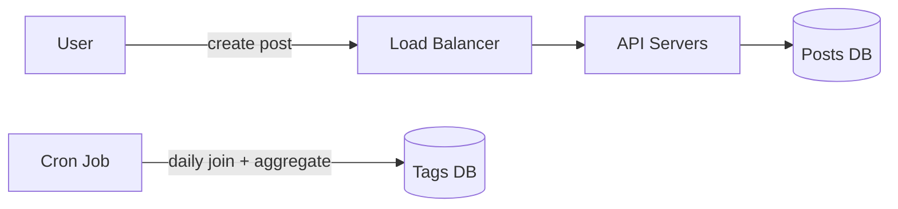
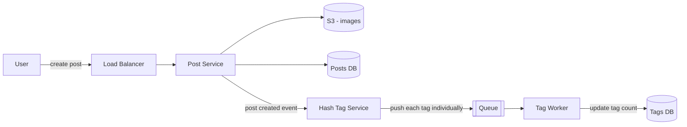
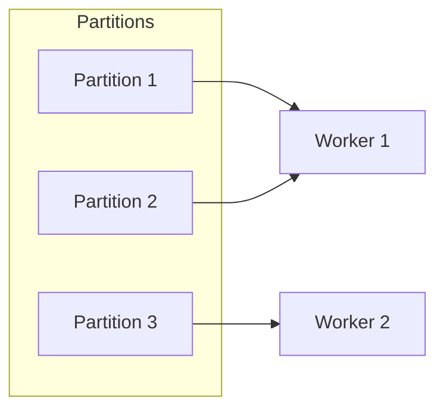
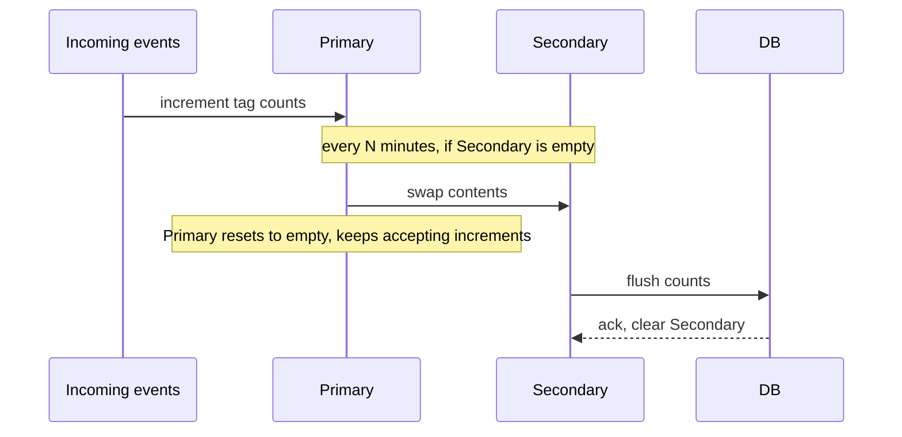
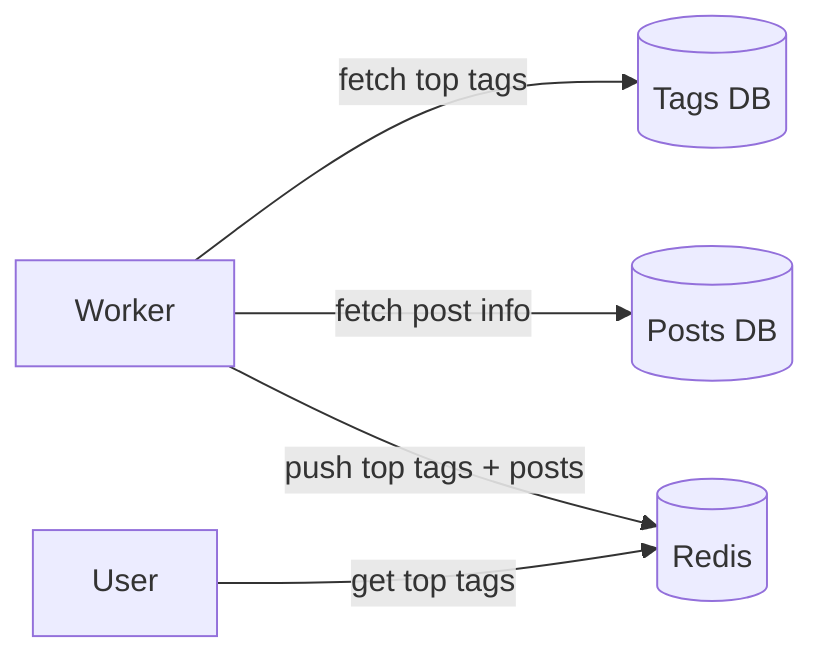

I sketched this out as a design exercise — a hashtag service that does what Instagram or Twitter's trending tags do: given a hashtag, show roughly how many posts are using it, and surface the top posts for it. Not a real production system, but I worked through it the way I'd want to defend it in a design review, including the parts where my first instinct was wrong and I had to walk it back.

This post follows that evolution roughly in the order it happened, because the dead ends are as useful as the destination.

## The requirement, stated up front

- Given a hashtag, return an approximate post count. **Absolute correctness is explicitly not required.**
- Show the top 2 posts for a given hashtag.
- Sub-second response times are not a hard requirement either — this isn't a latency-critical read path.

That last point — "approximate is fine" — turned out to matter more than I gave it credit for early on. More on that below.

## First attempt: compute it on read

The first shape I drew was simple: posts get written to a `Posts` table (id, hashtags, image, view count), and a daily cron job walks all the tags, joins against posts, sums view counts per tag, and picks the top 2 posts per tag as of that run.

This falls apart quickly for two reasons I wrote down at the time:
1. The join across all posts and all tags is expensive and gets slower as the dataset grows — there's no way to make it fast without fundamentally changing the approach.
2. It introduces up to a full day of staleness. A hashtag can go from nothing to viral within hours; a once-a-day batch job means it wouldn't show up as trending until the next run.

## Second attempt: event-driven counting

The fix was to stop computing counts in a batch job and instead update them incrementally as posts get created.

The post service emits a "post created" event. A hashtag service breaks the post's tags apart and pushes each tag onto a queue individually. Workers read off the queue and update per-tag counts in a database.

This is where the failure-mode questions started, and where most of the interesting design work actually happened.

## The dual-write problem

An early version of the incremental design had workers holding counts in an in-memory dictionary (tag name → count), periodically flushing to the database, with a Kafka offset tracked separately to know where to resume after a crash.

The problem: the DB write and the Kafka offset commit are two separate operations. If the DB write succeeds but the process crashes before the offset commit, replaying from the old offset re-processes messages that were already counted — silent double-counting. If it's the other way around, you lose a batch. This is the classic **dual-write problem**, and it shows up any time you're keeping an external log in sync with a store using two independent writes.

The fix that actually closes it: wrap the offset update and the count update in a **single database transaction**. If the database supports transactions, either both happen or neither does — no window where they can diverge.

Once I'd relaxed the correctness requirement further (see below), I realized the offset table wasn't needed at all. If undercounting on crash is an acceptable outcome, there's nothing to reconcile — a crashed worker just starts fresh.

## Partitions, workers, and rebalancing

Kafka topics are split into partitions, and a consumer group is a set of workers that split partitions among themselves — each partition is read by exactly one worker in a group at a time. That's what gives you parallelism, but it also puts a hard ceiling on it: partition count is the max number of workers that can usefully read a topic in parallel within one group. Two workers cannot split a single partition's messages between them — Kafka's ordering guarantee depends on exactly one consumer per partition per group.

Kafka manages this assignment through **rebalancing**: any time group membership changes (a worker joins, leaves, crashes, or misses a heartbeat), the coordinator redistributes partitions across whoever's currently alive. This can happen mid-stream, not just on crash — which matters because whatever's sitting in a worker's in-memory dictionary for a partition it's about to lose needs to be handled before ownership changes (the consumer API exposes a callback for exactly this — flush before the partition is revoked).

3 partitions, 2 workers: one worker just ends up owning two partitions. Not a broken state, just an uneven one.

## Sizing the problem

Before picking a partition/worker count, I needed an actual number to design against, not a vibe. Rough assumption: 100 million hashtags published across a 2-hour peak window. That's about **13,900 hashtags/second sustained**, with real bursts likely going higher during a viral moment.

A single lightweight consumer doing a simple in-memory increment can often handle on the order of tens of thousands of messages/sec — so at this average rate, a single worker isn't necessarily underwater. The partition/worker scaling question becomes a "plan ahead for growth and burst" problem rather than an "already broken" one.

## Revisiting "approximate is fine"

Here's the part where I'd drifted from my own requirement without noticing. I'd started this exercise explicitly saying exact counts weren't necessary — and then spent several iterations building transactional, crash-safe, exactly-once accounting. That's real engineering effort spent on a guarantee the product didn't ask for.

Two structures were worth comparing directly:

**Plain dictionary (tag name → count), in memory per worker.**
- Exact counts, straightforward to reason about.
- Memory grows with the number of *distinct* tags a worker has seen — unbounded unless something evicts old entries.

**Count-Min Sketch.**
- A fixed-size 2D array of counters (`d` rows × `w` columns), each row paired with a different hash function.
- To increment a tag, hash it through each of the `d` hash functions and increment the corresponding cell in each row.
- To query a tag's count, look up the same cells and take the **minimum** across rows — not the sum. Because other tags can collide into the same cell, a cell's value can be inflated by unrelated tags. Taking the minimum picks the row least affected by collisions, which means counts can only ever be **overestimated**, never underestimated.
- Fixed memory footprint regardless of how many distinct tags show up — the tradeoff for that is occasional inflated counts from collisions.

I initially assumed a dictionary was fine because I'd assumed a hard cap of ~1 million distinct hashtags. That number doesn't hold up on inspection — it was closer to "a number that made the memory math easy" than something derived from an actual constraint, and it doesn't account for multilingual tags at all (out of scope for this pass, noted explicitly below).

What actually resolves the unbounded-growth problem for the dictionary approach isn't the tag count assumption — it's **partitioning**. Each worker only ever holds the tags for its partition, not the entire tag space, which keeps any one worker's dictionary bounded by its slice rather than the whole system's cardinality. Given that, and given the scope is English lowercase tags only for now, I stuck with the dictionary over Count-Min Sketch — a real tradeoff, not a default.

## Bounding memory: the swap mechanism

Even partitioned, a worker's dictionary needs to stop growing at some point and get flushed. The mechanism I landed on:

- **Primary** dictionary receives live increments.
- Every 5 minutes (or some fixed interval), primary swaps into **secondary**, and primary resets to empty. Secondary is then responsible for writing its contents to the database.
- New increments after the swap go into the now-empty primary.

This bounds memory to "distinct tags seen in one interval," not "distinct tags seen ever" — a much better property than an unbounded dictionary.

The gap in the first version of this: what happens if secondary's database write is still in flight when the next 5-minute mark hits? An early fix considered a *third* buffer to hold overflow — but that adds a merge step (combining a carried-over count with a new batch) that doesn't need to exist. The simpler fix: **don't swap primary into secondary until secondary has finished writing.** Primary just keeps accumulating for one extra cycle if needed. Same accepted behavior on failure (a stuck secondary means an accepted lost count, consistent with "approximate is fine"), with less new state to reason about.

## Serving top tags and top posts

A separate worker periodically fetches top tags from the tags database, pulls the corresponding post information, and pushes that into Redis for fast reads — the actual "show me trending hashtags" request path reads from Redis rather than hitting the primary tables directly.

## Constraints and scope, made explicit

- **Language scope:** English, lowercase only, for this pass. Multilingual support is a known future requirement but explicitly out of scope here — it changes tag cardinality assumptions in ways worth a separate pass (unicode normalization, emoji tags, script-mixing).
- **Correctness:** approximate counts are acceptable by design. The system is built to tolerate undercounting on crash rather than guaranteeing exactness.
- **Throughput assumption:** designed around ~13,900 hashtags/sec sustained (100M over a 2-hour window), without a firm peak multiplier — a real design doc would want that number derived rather than assumed.
- **Consumer parallelism:** bounded by Kafka partition count. Partition count needs to be chosen with room for growth, since repartitioning after the fact is disruptive.

## Rollout

Shadow mode against live production traffic for two weeks, spot-checking estimated counts and trending order against actual on-the-ground reality, before flipping the feature on for all users. Shadow mode against real traffic (rather than a synthetic load test) matters here specifically because it's the only way to actually exercise the swap-skip logic and collision behavior under real peak load, rather than an approximation of it.

## What's still open

- **Stakeholder coordination** — who owns the surface this renders on (main feed, a dedicated discovery/explore section?), and whether abuse/moderation needs a say. Hashtag brigading — coordinated inflation of a tag's count to force it to trend — is a known failure mode for trending systems at this scale, and this design doesn't yet have an answer for it.
- **Peak vs. average throughput** — the sizing above uses a 2-hour average; no explicit peak multiplier has been derived yet.
- **Multilingual tags** — deferred, but will require revisiting the cardinality assumptions this design leans on.

## Closing note

This was a useful exercise specifically because of the places I got it wrong first — assuming exact counting was needed when the requirement said otherwise, picking a tag-cardinality number that made the math convenient rather than one that was actually derived, and reaching for a third buffer before realizing the simpler fix was to just wait. Writing it up in the order it actually happened, rather than jumping straight to the final design, felt more honest and more useful than a clean writeup would have been.
