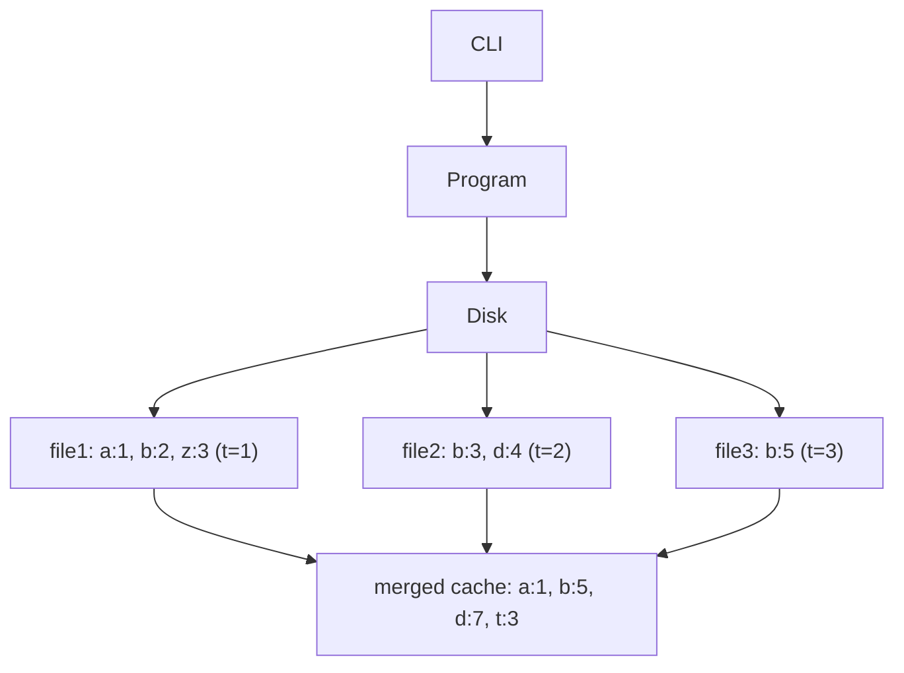
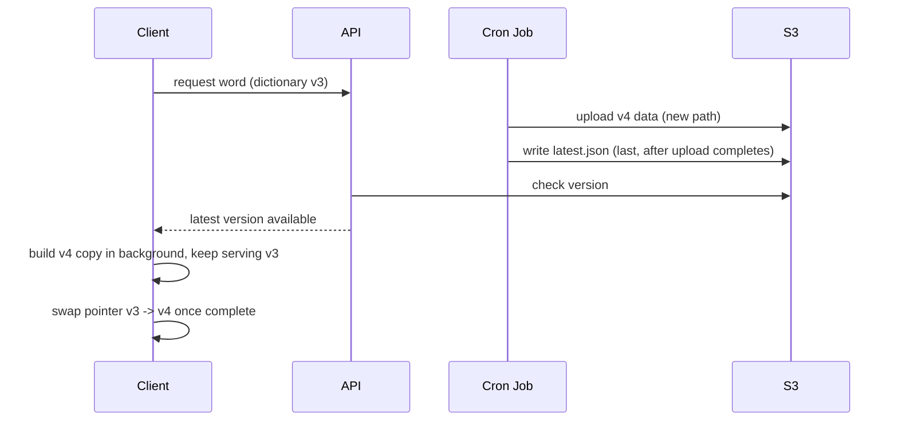

*This is a working-notes post from a self-imposed system design exercise (following Arpit Bhayani's course), not a production proposal. The constraint — no traditional database — is deliberate, meant to force reasoning about the primitives a database would normally give you for free: indexing, atomic writes, versioning.*

## The problem

Build a word dictionary service — think a simplified version of a dictionary API — without using a traditional database. Requirements:

- Scalable, and the storage needs to be persistent and **portable** (should be usable outside the server too, e.g. copied to a USB drive and looked up offline)
- API response time can be relaxed — this isn't a latency-critical path
- No traditional database
- Words and meanings get updated weekly, delivered through a changelog
- Lookup is always for a single word at a time
- The dictionary is ~1TB in size, with 170,000 words, no duplicate entries, and words sorted alphabetically

That last constraint — 1TB across 170,000 words — looks strange at first (roughly 6MB per word), until you separate two things that are easy to conflate: the *index* (word → location) and the *payload* (the actual meaning, which can include multiple senses, usage examples, and other content per word). The index stays small. The payload is where the size lives. That distinction ends up driving most of the design.

## First pass: dump it in S3, index it on the server

The initial idea was the simplest thing that could work: dump the dictionary into an S3 bucket, and have an API server download the whole file, build an in-memory map of `word → address` (an offset into the file), and serve lookups from that.

```mermaid
flowchart LR
    Client -->|get(word)| CDN
    CDN --> API
    API -->|word: address index| Disk[File Dist.]
    S3((S3)) -.-> API
```

This works for a single static snapshot, but it doesn't say anything yet about how updates get applied, or what happens when a read and a write land on the same word at the same time.

## Handling updates: append-only files instead of in-place edits

Rather than mutating a single dictionary file in place, each update becomes its own file — a small set of word→meaning changes, keyed to a timestamp. A helper index (`word: address`) is built for each new file, and periodically those indexes get merged into one consolidated in-memory cache.



The alternative — appending directly to one growing file, or rewriting the existing word's meaning in place — was considered and rejected: it adds the complexity of moving data around inside an existing file, versus just writing a new file and merging later. A background cron job periodically merges the per-update files into a consolidated file and frees up space, then updates the in-memory cache to point at the new locations.

This raised an open question in the original notes that didn't have an answer yet: **what happens during the contention window — a read for a word arriving at the same moment that word is being updated?**

## Index sizing: why the in-memory cache stays cheap

Before going further on the update path, it's worth showing why an in-memory index is viable at all given the "1TB, 170,000 words" numbers. Assume each word is ~100 bytes and each file-descriptor entry is ~32 bytes:

- Keys: 170,000 × 100 bytes ≈ 17MB
- File descriptors: 170,000 × 32 bytes ≈ 5.4MB

Both comfortably fit in memory — well under the 1TB figure. The 1TB lives entirely in the *meanings* — multiple senses, usage examples, additional metadata per word — which have no fixed size constraint. This is the key insight that makes the whole architecture work: **the index is small and fixed-size; the payload is large and variable-size, and lives on disk, addressed by offset.**

## Resolving the contention problem: versioned, immutable snapshots

The fix for the read/write race wasn't to make in-place updates safer — it was to stop doing in-place updates at all, and move to versioned snapshots instead:

- The client holds a version of the dictionary (say, v3).
- When a new version (v4) is ready, the server publishes it to a **new, separate path** in S3 — v3's data is never touched.
- Only after the full v4 upload completes does the server write a `latest.json` pointer file, which is what clients check to know the current version.
- On the client side, the background sync process downloads the changelog and applies it to a **new copy** of the local dictionary while v3 keeps serving reads as normal. Only once that new copy is fully built does the client flip its own version pointer from v3 to v4.



The invariant that falls out of this: **no reader — server or client — ever observes a partially-written version.** `latest.json` is written last, only after every byte of the new version has landed, so a version either doesn't exist yet or exists in full. That's what actually answers the original contention question — not a lock or a retry mechanism, but structuring updates so there's nothing to contend over in the first place.

This also opened a secondary optimization: instead of clients re-downloading the entire dictionary on every version bump, only the **changelog** (the diff) needs to be sent — the client applies it locally to build the new version. This saves meaningful bandwidth given how infrequently full re-downloads should be necessary.

## The portable version

The "portable" requirement — the dictionary needs to work as a standalone artifact, copyable to a USB drive, with no server involved — needed its own format:

```
[ total length ][ key section length ][ key section: word -> offset, sorted ][ meaning payloads ]
```

The client reads the header to know where the key section ends and the payload begins, loads the (small, ~17-22MB) key section into memory, and looks up a word directly against it before seeking to the right offset in the payload section on disk.

One design question worth calling out explicitly: the keys are stored **sorted alphabetically**, but the actual lookup uses an **in-memory hashmap**, not a binary search over the sorted array. Those are two different things serving two different purposes:

- The **hashmap** is what gives O(1) lookup at read time.
- The **sorted order** isn't for lookup at all — it's what makes merging an incoming changelog into the existing index cheap, since both can be walked in a single linear pass rather than requiring random inserts.

It's easy to read "sorted alphabetically" in a requirements list and assume it exists to serve lookups. Here it doesn't — it exists to serve the merge step. Worth stating plainly if you're writing this up for someone else, since the natural assumption runs the other way.

## Open questions

A few things that came up but are genuinely still open, rather than papered over:

- What happens on a partial write or crash *mid-upload*, before `latest.json` is written — is there cleanup of orphaned partial-version data?
- How does a bad or corrupt changelog get detected before a client applies it?
- SSD vs. HDD seek behavior for the payload lookup is left to the OS and disk driver rather than branched on in the lookup code — reasonable, but worth stating as a deliberate non-decision rather than an oversight.
- This design hasn't been pressure-tested against "why not just use SQLite as a single portable file" — which gets sorted B-tree indexes, atomic writes, and portability for free. That's a fair question for a real system, but it's also somewhat beside the point here: the exercise is to build the primitives a database gives you for free, in order to understand them, not to avoid using a database for its own sake.

## Closing note

This is part of an ongoing exercise in working through storage-engine fundamentals from first principles — the same territory that WAL, LSM-tree compaction, and B-tree/hash indexing occupy in real systems, just built by hand to see why those primitives exist in the first place.
