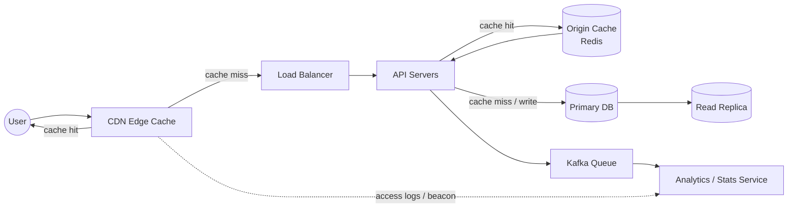

This one's a working-notes post — a reconstruction of a system design interview question on building a URL shortening service, and specifically the follow-up thread on "what happens under a huge burst of requests." I got the first-pass answer wrong (or at least incomplete), and the value here is less in the final design and more in *where* the reasoning broke and how it got fixed under questioning. Keeping that progression intact rather than jumping straight to the clean answer.

## The original ask

Build a URL shortening service:

- A form to input long URLs and return shortened links
- Backend service to store mappings and handle redirection
- Shortening logic using base62/hash
- A working redirect route (`/abc123` → long URL)
- DB storage of links and click stats (bonus)

My whiteboard sketch had the standard shape: client → load balancer → API servers → primary DB (writes) + read replica, a Redis-style cache, and a Kafka queue feeding an analytics/stats service. Schema was roughly:

```
urlshorten: id, long_url, short_url, expire_at, user_id
```

with the short code generated as a one-way hash of `long_url + user_id`.

## Where it broke: "what if there's a huge burst of requests?"

My first answer: fall back to caching URLs at the API server layer, and accept that requests would time out while the servers scaled up. I mentioned CDNs as a possibility but wasn't confident they applied — I associated CDNs with static assets (images, JS bundles), not redirects, and I wasn't sure how a CDN would interact with the analytics requirement (counting clicks) if the CDN served the response instead of my origin.

That uncertainty was the actual gap. Worth stating explicitly, because it's a common one: **a redirect is just an HTTP response with a 3xx status and a `Location` header — CDNs cache HTTP responses generically, not just images.** They don't care what's in the response. Edge-caching redirects for a URL shortener is a well-known pattern, not an edge case.

Once that clicked, the rest of the "burst" answer fell into place:

- First request for `/abc123` → CDN edge cache miss → hits origin (API server → DB lookup) → returns the redirect → CDN caches the response.
- Every subsequent request for that same code, from anywhere, is served straight from the edge — origin never sees it again until the cache entry expires or gets invalidated.

This maps well onto what a "burst" actually looks like in practice: it's rarely uniform traffic, it's usually many people hitting the *same* small set of hot links (a viral post, a campaign). CDN caching is specifically good at absorbing exactly that shape of load. The origin only has to deal with the long tail of first-hits and misses.

## Decoupling analytics from the redirect

The second wrong assumption was that analytics *required* going through the API server on every request — otherwise, how would clicks get counted? But the redirect response has already gone out to the user by the time you'd want to count it, so there's no reason click-tracking needs to be synchronous with serving the redirect. Two options that work:

- Ship CDN access logs (most CDNs support this — real-time log streams or batch logs) into the analytics pipeline.
- Fire a beacon/pixel client-side after the redirect, independent of whether origin was even involved in that particular request.

Either way, analytics is decoupled from the request path entirely.

## Cache invalidation: TTL vs. expiry aren't the same thing

Next gap: I initially set the CDN cache TTL equal to the *user-set link expiry* (e.g., a link set to last a year → cache TTL of a year). Those are different concepts that happen to share a word. Link expiry is "when should this stop working." Cache TTL is "how long can the edge serve a stale copy without checking origin." Conflating them means a deleted or abuse-flagged link stays live at every edge node until the (possibly very long) TTL naturally expires.

The fix: decouple them. Purge attempt on delete (calling the CDN's invalidation API — most support purge-by-path or by cache tag), but don't make the user-facing delete operation *synchronous* on that call succeeding. If the CDN purge API is slow or down, you don't want your users unable to delete their own links.

Instead: async, best-effort purge + a short cache TTL (10–15 min) as the actual safety bound. This is an explicit, named risk: a deleted or spam-flagged link may still redirect for up to that window if the purge call fails. That's a defensible tradeoff, stated out loud — much better than either pretending the risk doesn't exist, or over-correcting into synchronous purge and coupling user-facing latency to a third-party API.

**Stale-while-revalidate** softens the cost of a short TTL: instead of the cache being a hard cliff (serve fresh, then block the next request on a synchronous origin fetch at expiry), the edge keeps serving the cached copy while asynchronously revalidating in the background. No user gets stuck waiting on an origin round-trip just because they were the one who hit it right after expiry. Same caveat applies, slightly widened: there's now a small window right after a delete where a stale-but-not-yet-revalidated response could still be served. Worth deciding you're okay with that window explicitly, rather than by omission.

## Two-tier caching, not one

Late in the discussion it became clear the origin-side cache (Redis, in the original diagram) wasn't made redundant by the CDN — it protects against a different failure mode:

- **CDN edge cache** — absorbs the burst/repeat-hit traffic; most requests never reach the origin at all.
- **Origin cache (Redis) in front of the DB** — absorbs the traffic that *does* reach origin on a CDN miss (cold cache, first hit, or a burst of many *different* short codes going viral at once), so the DB doesn't take that load directly.

Two layers protecting against two different things, not one cache with two names.

## Short code length: replacing a guess with a calculation

I originally didn't state a code length at all, just assumed `long_url + user_id` hashing "wouldn't collide" — which isn't really an assumption you get to make; hash truncation to a short code collides by construction once the space is small enough. When pushed on length, I guessed 12 characters ("more space, feels safer"), then walked it back to 8 without actually running the numbers either time.

The right tool here is the birthday-paradox approximation, not straight division — you're checking every *pair* of generated codes against each other, so collisions show up well before the code space is anywhere near full:

```
expected collisions ≈ n² / (2N)
```

where `n` = total codes generated over the system's life, `N` = total possible codes (62^length for base62).

At an assumed volume of 100M new short URLs/month over 5 years (`n ≈ 6 billion`):

| Length | N (62^length)     | Expected collisions |
|--------|--------------------|----------------------|
| 8      | ≈ 2.18 × 10¹⁴       | ≈ 82,000             |
| 9      | ≈ 1.35 × 10¹⁶       | ≈ 1,300              |

~82,000 collisions out of 6 billion generated codes is a ~0.0014% rate — negligible, and exactly the load the retry-on-conflict logic below is designed to absorb without anyone noticing. 12 characters buys essentially nothing extra at this volume, at the cost of a URL that's 50% longer — which works against the actual point of the product being *short*.

**Takeaway:** code length should come from a volume estimate run through the collision formula, not a round number that "feels" safe.

## Collision handling: check-then-insert has a race

Even with 8 characters chosen deliberately, collisions aren't theoretical — the calculation above says to expect them. Original plan was "check uniqueness, then insert, retry with a salt/timestamp if taken." That two-step shape has a race: two requests can both check, both see the code as free, and both attempt to insert before either commits.

The fix is to skip the separate check entirely and rely on the DB's unique constraint on `short_url` to do the check atomically as part of the write itself. Attempt the insert; if it fails on a unique-constraint violation, that failure *is* the signal to regenerate the code and retry. No window between check and insert for two concurrent requests to slip through.

Worth being precise with terminology here too: this is **insert-with-retry-on-conflict**, not "upsert" — upsert implies overwriting on conflict, which is wrong here (a collision shouldn't overwrite someone else's mapping; it should generate a new code for the new URL).

## Full design, after all of the above



- **Redirect path:** CDN edge cache first → origin Redis cache on miss → DB as last resort. Most traffic, including bursts, never reaches origin.
- **Analytics:** decoupled from the redirect via CDN access logs or a client-side beacon, never blocking the response.
- **Cache invalidation on delete:** async best-effort purge + short TTL (10–15 min) as the bound, with the risk explicitly accepted rather than hidden.
- **Stale-while-revalidate:** avoids synchronous origin round-trips at expiry, same bounded staleness risk, slightly widened around deletes.
- **Short code length:** 8 characters, justified against an assumed 100M/month volume via the birthday-paradox formula, not picked by feel.
- **Collision handling:** atomic insert-with-retry-on-conflict — no separate check-then-insert step to race against.

## What's still unresolved

- Exact volume assumption (100M/month) was mine for the sake of running the math in the interview — worth re-deriving against real expected traffic if this were an actual system, not an interview exercise.
- Didn't get into read-replica lag or how the API layer decides when to read from replica vs. primary — a reasonable next thread if pushed further.
- Didn't discuss rate limiting on link creation, which is a fairly obvious abuse vector for a public shortening service and wasn't raised in this round.

## Closing note

The most useful part of this exercise wasn't the final design — it's fairly standard once assembled. It was noticing how many of the gaps were "stated a number/decision without running the calculation or naming the tradeoff" rather than "didn't know the concept at all." Redoing the code-length question three times before actually computing anything is the tell. Next time: run the numbers before saying the number.
